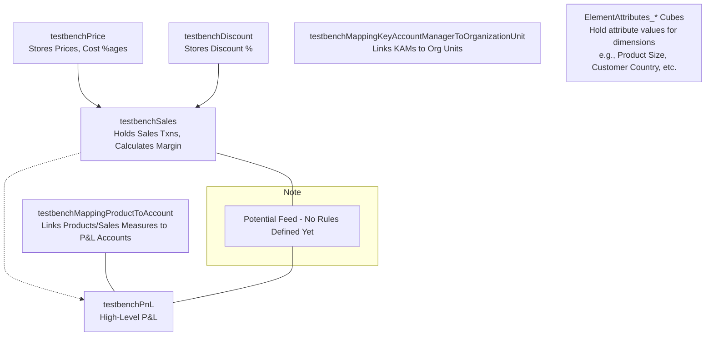

# TM1 Benchmark Model Generator
This opensource repository for the TM1 community. The solution was created to provide a Pyhonic TM1 benchmark model generator for automated testing, and performance testing internal tools.

## 1. General Purpose

This project provides a flexible and powerful framework for programmatically generating TM1 models based on configuration files. Its primary purpose is to create reproducible and customizable benchmark environments within TM1 / IBM Planning Analytics.

**Main Use Cases:**

*   **Performance Benchmarking:** Generate large, structured models and datasets to test TM1 server performance, rule execution, query times, and data loading speeds under various conditions.
*   **Application Testing:** Create standardized TM1 models as a baseline for testing external applications, APIs, or reporting solutions that interact with TM1.
*   **Unit Testing:** Build specific, small models to unit test custom TM1 functions, TI processes, or API interactions.
*   **Demo Creation:** Quickly generate realistic-looking models and data for customer demonstrations or training purposes.
*   **Reproducibility:** Ensure that benchmark models can be consistently rebuilt by defining their entire structure and data generation logic in version-controllable configuration files.

The core mechanism involves defining TM1 objects (dimensions, cubes) and data generation procedures in YAML files. A Python engine then parses these files and uses the TM1py library to interact with the TM1 REST API, building the model and populating it with data according to the specifications.

## 2. Schema Introduction: YAML Configuration Files

The generator's behavior is controlled entirely by a set of YAML files located in a designated schema directory. There are 6 main types of YAML files:

---

### 2.1. `schema.yaml` (Orchestrator)

*   **Purpose:** The main control file. It specifies *which* individual definition files (for dimensions, cubes, datasets, etc.) should be loaded and processed for a particular model build.
*   **How to Use:** Edit the lists under the `import:` key to include the base filenames (without `.yaml`) of the specific definition files you want to use. Ensure these files exist in the corresponding subdirectories.
*   **Structure & Example:**
    ```yaml
    # schema.yaml
    import:
      cubes:
        - Sales       # Looks for ./cubes/Sales.yaml
        - Price
      dimensions:
        elementlist:  # Looks in ./dimensions/elementlist/
          - version
          - measuresales
        df_templates: # Looks in ./dimensions/df_templates/
          - product
          - customer
        custom:       # Looks in ./dimensions/custom/
          - period
      datasets:       # Looks in ./datasets/
        - sales_data
        - product_attributes
      config:         # Looks in ./ (root schema directory)
        - config      # Expects ./config.yaml
      variables:      # Looks in ./ (root schema directory)
        - variables   # Expects ./variables.yaml
    ```
*   **Parameters (`import:` keys):**
    *   `cubes`: (List[str]) Base filenames of Cube Definition YAMLs.
    *   `dimensions`: (Dict) Contains keys for dimension generation methods:
        *   `elementlist`: (List[str]) Base filenames for `elementlist` Dimension YAMLs.
        *   `df_templates`: (List[str]) Base filenames for `df_template` Dimension YAMLs.
        *   `custom`: (List[str]) Base filenames for `custom` Dimension YAMLs.
    *   `datasets`: (List[str]) Base filenames of Dataset Template YAMLs.
    *   `config`: (List[str]) Usually `["config"]`, pointing to the global `config.yaml`.
    *   `variables`: (List[str]) Usually `["variables"]`, pointing to the `variables.yaml`.

---

### 2.2. `config.yaml` (Global Settings)

*   **Purpose:** Stores global settings for the generator's execution, including TM1 connection details, the active environment, default data loading parameters, and file paths.
*   **How to Use:** Define the active environment (`default_yaml_env`), configure TM1 connection parameters securely, set default data loading behavior via `df_to_cube_default_kwargs`, and define the paths to definition subdirectories.
*   **Structure & Example:**
    ```yaml
    # config.yaml
    default_yaml_env: "dev" # Active environment (e.g., "dev", "test", "large_scale")

    df_to_cube_default_kwargs:
      clear_before_load: True
      clear_set: []
      async_write: True
      slice_size_of_dataframe: 50000
      use_blob: True
      use_ti: False

    # Defines relative paths from the main schema directory
    paths:
      dimensions_elementlist: 'dimensions/elementlist'
      dimensions_df_templates: 'dimensions/df_templates'
      dimensions_custom: 'dimensions/custom'
      cubes: 'cubes'
      datasets: 'datasets'
      config: '.'  # Relative path to config.yaml itself
      variables: '.' # Relative path to variables.yaml

    # RECOMMENDED: Add TM1 Connection Info Here
    # tm1_connection:
    #  address: localhost
    #  port: 8000 # Your HTTPPortNumber
    #  user: admin
    #  # IMPORTANT: Avoid plaintext passwords. Use environment variables or other secure methods.
    #  password: ${TM1_PASSWORD_ENV_VAR} # Example using env var lookup (requires Python code change)
    #  namespace: # Optional: Add CAM Namespace if needed
    #  ssl: False
    ```
*   **Parameters:**
    *   `default_yaml_env`: (String) Name of the environment key used to select configurations in other YAML files.
    *   `df_to_cube_default_kwargs`: (Dict) Default parameters for TM1py's `write_dataframe` functions:
        *   `clear_before_load`: (Boolean) Clear target slice before loading?
        *   `clear_set`: (List) Advanced: Specific MDX slice to clear.
        *   `async_write`: (Boolean) Use asynchronous data writing?
        *   `slice_size_of_dataframe`: (Integer) Rows per chunk for large uploads.
        *   `use_blob`: (Boolean) Use efficient blob upload method? (Recommended `True`)
        *   `use_ti`: (Boolean) Use temporary TI process for loading? (Usually `False`)
    *   `paths`: (Dict) Defines relative paths to definition subdirectories. Keys match those used internally by `SchemaLoader`.
    *   `tm1_connection`: (*Recommended*) (Dict) Centralize TM1 connection details (requires adapting `utility.tm1_connection`). Keys: `address`, `port`, `user`, `password` (handle securely!), `namespace`, `ssl`.

---

### 2.3. `variables.yaml` (Constants & Data Pools)

*   **Purpose:** A central repository for reusable lists, constants, and structured data used during data generation (e.g., lists of names, country details, product sizes). Helps avoid hardcoding and improves maintainability.
*   **How to Use:** Define categories using top-level keys. Populate with lists or dictionaries. Reference these values in Dataset Templates using the `variable_path` parameter within a `callable` function's `params`.
*   **Structure & Example:**
    ```yaml
    # variables.yaml
    gender:
      M:
        name: "Male"
        short: "M"
        first_names: ["George", "Lukas", "Mark"]
      F:
        name: "Female"
        short: "F"
        first_names: ["Ruth", "Eva", "Mary"]
    last_names: ["Skywalker", "Atreides", "Kenobi"]
    product_size: ["S","M","L","XL"]
    countries:
      HU:
        shortname: "HU"
        name: "Hungary"
        currency: "HUF"
        region: "EMEA"
      US:
        shortname: "US"
        name: "United States"
        currency: "USD"
        region: "Americas"
    # ... more variables
    ```
*   **Parameters:** Keys and structure are user-defined based on needs. Values are accessed via `variable_path` in dataset `params` (e.g., `variable_path: "variables.countries"`, `variable_path: "variables.gender.M.first_names"`).

---

### 2.4. Dimension Definition YAMLs

*   **Purpose:** Define the structure (elements, hierarchy, attributes) of a single TM1 dimension. Stored in subdirectories under `./dimensions/` based on the generation method.
*   **Common Structure:** All dimension files are keyed by environment (e.g., `dev:`), under which the specific configuration resides.
    ```yaml
    # Common structure: <dimension_file_name>.yaml
    dev: # Matches default_yaml_env from config.yaml
      dimension_name: "MyDimensionName" # Desired name in TM1
      # ... Method-specific keys below ...
    test:
      dimension_name: "MyTestDimensionName"
      # ... Test environment specifics ...
    ```
*   **Parameters (Common):**
    *   `<environment_name>:` (String, e.g., `dev`) The top-level key matching the active environment.
    *   `dimension_name:` (String) The name the dimension will have in TM1.

*   **Method 1: `elementlist` (Manual Definition)**
    *   **Location:** `./dimensions/elementlist/`
    *   **Use Case:** Small dimensions, fixed lists, irregular hierarchies, measure dimensions.
    *   **Example (`./dimensions/elementlist/version.yaml`):**
        ```yaml
        dev:
          dimension_name: "testbenchVersion"
          elements:
            - { name: "Actual", element_type: "Numeric" }
            - { name: "Forecast", element_type: "Numeric" }
            - { name: "Budget", element_type: "Numeric" }
          edges: [] # Empty list for flat dimension
          attributes:
            - { name: "ShortAlias", attribute_type: "Alias" }
            - { name: "Description", attribute_type: "String" }
        ```
    *   **Parameters (`elementlist` specific):**
        *   `elements`: (List[Dict]) Defines each element.
            *   `name`: (String) Element name.
            *   `element_type`: (String) TM1 type: `"Numeric"`, `"String"`, `"Consolidated"`.
        *   `edges`: (List[List]) Optional: Defines hierarchy `[ParentName, ChildName, Weight]`. Empty (`[]`) or omitted for flat dimensions.
        *   `attributes`: (List[Dict]) Optional: Defines attributes *to be created*.
            *   `name`: (String) Attribute name.
            *   `attribute_type`: (String) TM1 type: `"String"`, `"Numeric"`, `"Alias"`.

*   **Method 2: `df_template` (DataFrame Generation)**
    *   **Location:** `./dimensions/df_templates/`
    *   **Use Case:** Large dimensions, regular structures, programmatically generated hierarchies.
    *   **Example (`./dimensions/df_templates/product.yaml`):**
        ```yaml
        dev:
          dimension_name: "testbenchProduct"
          df_template:
            elements:
              NumberOfElements: 10000
              ElementPrefix: "P"
              ElementLength: 8 # Numeric part length (e.g., P00000001)
              Method: "enumerate" # Generate sequentially
            levels:
              - name: "level000" # Internal name for DataFrame column
                constant_content: "All Products" # Top node name
              - name: "level001"
                content_template: # Define how parent elements at this level generated
                  Prefix: "ProductGroup"
                  Length: 2
                  Method: "enumerate"
            attributes: # Attributes to create (type via suffix)
              - "Size:s"
              - "Color:s"
              - "CostType:a"
        ```
    *   **Parameters (`df_template` specific):**
        *   `df_template`: (Dict) Contains generation instructions.
            *   `elements`: (Dict) Base element generation.
                *   `NumberOfElements`: (Integer) How many leaf elements.
                *   `ElementPrefix`: (String) Prefix for element names.
                *   `ElementLength`: (Integer) Length of the *numeric part* after prefix (for zero-padding).
                *   `Method`: (String) Generation method (e.g., `"enumerate"`).
            *   `levels`: (List[Dict]) Defines hierarchy levels (top-down).
                *   `name`: (String) Internal column name (e.g., `level000`).
                *   `constant_content`: (String) Name of the single top node consolidation.
                *   `content_template`: (Dict) For intermediate levels, defines how parent consolidation elements are generated (`Prefix`, `Length`, `Method`). **Note:** How base elements roll up is implicit in Python code.
            *   `attributes`: (List[String]) Attributes to create. Type suffix: `:s` (String), `:n` (Numeric), `:a` (Alias).

*   **Method 3: `custom` (Custom Python Function)**
    *   **Location:** `./dimensions/custom/`
    *   **Use Case:** Complex, unique logic (e.g., advanced Time dimensions with fiscal years, specific calculations).
    *   **Example (`./dimensions/custom/period.yaml`):**
        ```yaml
        dev:
          dimension_name: "testbenchPeriod"
          callable: "dimension_period_builder.generate_time_dimension" # Path to Python function
          kwargs: # Parameters passed TO the function
            year_start: 2024
            year_end: 2028
            monthly: 1 # Use 1/0 or true/false (depends on function)
            daily: 0
            quarterly: 0
            start_month_of_the_year: 1
            ytd: 1
            ytg: 0
            attributes: # Example: Define calculated attributes
              - name: "PREV_PERIOD:s"
                type: "String" # Redundant if using suffix? Choose one convention.
                method: "time_reference" # Identifier for logic within the Python function
                referenced_period_distance: -1 # Parameter for the 'time_reference' method
              - name: "MonthName:s"
                type: "String"
                method: "format"
                format: "MMMM" # Parameter for the 'format' method
        ```
    *   **Parameters (`custom` specific):**
        *   `callable`: (String) Full Python import path (`module.submodule.function_name`) to the function that generates the dimension DataFrame.
        *   `kwargs`: (Dict) Dictionary of parameters passed directly to the specified `callable` function. Structure depends entirely on the target function's requirements.

---

### 2.5. Cube Definition YAMLs

*   **Purpose:** Define the structure (dimensionality) and business logic (rules) for a single TM1 cube.
*   **Location:** `./cubes/`
*   **How to Use:** Define the cube name, list its dimensions (ensure they are defined elsewhere in the schema), and provide the TM1 rules as a list of strings.
*   **Structure & Example (`./cubes/Sales.yaml`):**
    ```yaml
    dev:
      name: "testbenchSales"
      # Dimension order impacts performance! List sparse (large) dims earlier.
      dimensions:
        - "testbenchCustomer"
        - "testbenchProduct"
        - "testbenchPeriod"
        - "testbenchVersion"
        - "testbenchKeyAccountManager"
        - "testbenchMeasureSales"
      rules:
        - "SKIPCHECK;"
        - "FEEDERS;"
        - "# Revenue Calculation"
        - "['Revenue'] = N: ['Quantity'] * DB('testbenchPrice', !testbenchVersion, !testbenchPeriod, !testbenchProduct, 'Price');"
        - "['Quantity'] => ['Revenue'];"
        # ... more rules and feeders
    test:
      name: "testbenchSales_Small"
      dimensions: ["product", "version", "measuresales"] # Smaller structure for test
      rules: ["SKIPCHECK;"]
    ```
*   **Parameters:**
    *   `<environment_name>:` (String) Top-level key.
    *   `name:` (String) Desired cube name in TM1.
    *   `dimensions:` (List[String]) Names of dimensions comprising the cube. **Order is critical for performance.**
    *   `rules:` (List[String]) TM1 rules, one string per line. Standard TM1 syntax applies. Empty list (`[]`) or `[""]` means no rules.

---

### 2.6. Dataset Template YAMLs

*   **Purpose:** Define how to generate and load data into a specific target TM1 cube (data cube or attribute cube).
*   **Location:** `./datasets/`
*   **How to Use:** Specify the target cube, define the scope (intersections) using MDX and row count, identify the dimension containing measures/attributes to populate, and configure the generation method (`callable` function and its `params`) for each measure/attribute.
*   **Structure & Example (`./datasets/sales_data.yaml`):**
    ```yaml
    dev:
      targetCube: "testbenchSales"
      rows:
        # MDX defining the slice scope. Use '*' to combine sets.
        # WARNING: Avoid hardcoding elements like [202401] if possible. Use dynamic MDX.
        mdx: >
          {[testbenchVersion].[Actual]} *
          {DESCENDANTS([testbenchPeriod].[All Periods], 99, LEAVES)} *
          {TM1FILTERBYLEVEL({TM1SUBSETALL([testbenchProduct])}, 0)} *
          {TM1FILTERBYLEVEL({TM1SUBSETALL([testbenchCustomer])}, 0)} *
          {TM1FILTERBYLEVEL({TM1SUBSETALL([testbenchKeyAccountManager])}, 0)}
        number_of_rows: 1500000 # Generate 1.5M random intersections within the MDX scope. -1 for all.
      data_colum_dimension: "testbenchMeasureSales" # Dim containing elements listed under 'data:'
      data:
        # Key is Element Name from 'data_colum_dimension'
        Quantity:
          method: "function"
          callable: "df_generator_for_dataset._random_number_based_on_statistic"
          params:
            min_val: 0
            max_val: 100
            num_type: "int"
            distribution: "normal"
            mean: 65
            std_dev: 20
        # 'Price', 'Discount', etc. are calculated by rules, so no data gen needed here
    ```
*   **Example (`./datasets/product_attributes.yaml`):**
    ```yaml
    dev:
      targetCube: "}ElementAttributes_testbenchProduct" # Target attribute cube
      rows:
        mdx: "{TM1FILTERBYLEVEL({TM1SUBSETALL([testbenchProduct])}, 0)}" # Target base elements
        number_of_rows: -1 # All base elements
      data_colum_dimension: "}ElementAttributes_testbenchProduct" # Attribute dim itself
      data:
        # Key is Attribute Name
        Size:
          method: "function"
          callable: "df_generator_for_dataset._random_from_variable_list"
          params:
            variable_path: "variables.product_size" # Get random size from variables.yaml
        CostType:
          method: "function"
          callable: "df_generator_for_dataset._generate_from_subset_mdx"
          params:
            dimension_name: "testbenchAccount" # Dimension to query
            # MDX to get list of 'Cost' accounts to randomly assign
            subsetMDX: '{TM1FILTERBYPATTERN({TM1FILTERBYLEVEL({TM1SUBSETALL([testbenchAccount])},0)}, "*Cost*")}'
    ```
*   **Parameters:**
    *   `<environment_name>:` (String) Top-level key.
    *   `targetCube:` (String) Name of the cube to load data into.
    *   `rows`: (Dict) Defines the data scope.
        *   `mdx`: (String) MDX query (or `*`-separated queries) defining the element sets for the target slice dimensions.
        *   `number_of_rows`: (Integer) `-1` for all combinations from MDX, positive integer `N` for `N` randomly sampled unique combinations.
    *   `data_colum_dimension:` (String) Name of the dimension whose elements/attributes are specified as keys under `data:`.
    *   `data:` (Dict) Maps element/attribute names to their generation logic.
        *   `<ElementNameOrAttributeName>`: (Dict) Key matches name in `data_colum_dimension`.
            *   `method`: (String) Currently `"function"`.
            *   `callable`: (String) Full Python import path to a generator function (usually in `df_generator_for_dataset`).
            *   `params`: (Dict) Parameters required by the `callable` function. Structure varies by function (see below).

*   **Built-in Data Generator Functions (`callable` targets):**
    *   `df_generator_for_dataset._random_number_based_on_statistic`: Generates random numbers.
        *   `params`: `min_val`, `max_val`, `num_type` (`"int"`/`"float"`), `distribution` (`"uniform"`/`"normal"`/`"exponential"`/`"triangular"`), optional `mean`, `std_dev`, `rate`, `mode` depending on distribution.
    *   `df_generator_for_dataset._random_from_variable_list`: Selects a random item from a list or dictionary keys defined in `variables.yaml`.
        *   `params`: `variable_path` (e.g., `"variables.product_size"`, `"variables.countries"`).
    *   `df_generator_for_dataset._look_up_based_on_column_value`: Looks up a value in `variables.yaml` based on the value of *another column generated within the same dataset*. **Note:** Potential performance issue in current implementation; pandas `map`/`merge` is preferred (requires Python change).
        *   `params`: `referred_column` (name of column to base lookup on), `variable_path` (path to dict in `variables.yaml`), `variable_key` (key within that dict to retrieve), optional `prefix`, `postfix` (strings to add).
    *   `df_generator_for_dataset._generate_from_subset_mdx`: Executes an MDX query against a dimension and returns a random element from the result set.
        *   `params`: `dimension_name`, `hierarchy_name` (optional, defaults to dim name), `subsetMDX`.
    *   `df_generator_for_dataset._getCapitalLetters`: Extracts capital letters from the value of another dimension column in the current row context.
        *   `params`: `apply_on_column` (name of dimension column).
    *   `df_generator_for_dataset._index_from_variable_list`: Selects an item from a list/dict keys in `variables.yaml` based on the row index (useful for non-random assignment).
        *   `params`: `variable_path`.

---

## 3. Python Project Structure

The Python code translates the YAML definitions into actions using the TM1py library.

*   **`tm1_bench.py` (Orchestrator & Loader):**
    *   `SchemaLoader`: Class responsible for reading `schema.yaml` and loading all referenced definition files based on the configured paths and active environment (`load_schema()`). Returns a structured dictionary representing the desired model.
    *   `build_model(tm1, schema)`: Main function to drive the model build. Takes TM1 connection and loaded schema. Calls `create_dimensions`, `create_cubes`, `generate_data`.
    *   `destroy_model(tm1, schema)`: Main function to clean up. Calls `delete_cubes`, `delete_dimensions`.
    *   `create_dimensions(tm1, schema)`: Iterates dimensions in schema, calls appropriate builder functions.
    *   `create_cubes(tm1, schema)`: Iterates cubes in schema, creates them, and uploads rules.
    *   `generate_data(tm1, schema)`: Iterates datasets in schema, calls `df_generator_for_dataset.generate_dataframe` to get data, then calls `utility._dataframe_to_cube_default` to load it.
    *   `delete_cubes`, `delete_dimensions`: Helper functions for cleanup.
*   **`dimension_builders.py` (*Suggested Module*):**
    *   `create_dimension_from_elementlist(...)`: Builds dimension from explicit lists/edges.
    *   `create_dimension_from_dataframe_template(...)`: Builds dimension using `df_template` instructions.
    *   Helper functions (`generate_hierarchy_dictionary`, `hierarchy_to_dataframe`, etc.): Internal logic for `df_template` processing.
*   **`dimension_period_builder.py` (Time Specialist):**
    *   `generate_time_dimension(**kwargs)`: Custom function (referenced by `custom` dimension YAML) specifically for creating complex time dimensions. Input `kwargs` come from the YAML definition. Returns a pandas DataFrame.
*   **`df_generator_for_dataset.py` (Data Factory):**
    *   `generate_dataframe(dataset_template, tm1, schema)`: Core function that takes a dataset template, determines the scope via MDX, calls the specified `callable` functions to generate values, and returns a pandas DataFrame ready for loading.
    *   `_random_number_based_on_statistic`, `_random_from_variable_list`, etc.: The individual data generation algorithms called dynamically based on the `callable` key in dataset templates. Inputs include `params` from YAML, `schema`, current row context. Output is a single data value.
    *   MDX Helpers (`_create_subset_from_mdx`, `_get_metadata_from_mdx`, etc.): Utilities used by `generate_dataframe` to interpret MDX and get element lists for defining the data scope.
*   **`utility.py` (Toolkit):**
    *   `tm1_connection()`: Establishes TM1py service connection (reads `config.ini` currently, *should ideally read from loaded schema/config.yaml*).
    *   Logging Functions (`log_exec_metrics`, etc.): Decorators and setup for logging execution time and standard messages.
    *   `_dataframe_to_cube_default(...)`: Wrapper around TM1py's `write_dataframe` methods, applying defaults from `config.yaml`.
    *   `_clear_cube_default(...)`: Wrapper for clearing cube data based on MDX.
*   **`sample.py` (Entry Point):**
    *   Demonstrates how to initialize `SchemaLoader`, load the schema, connect to TM1, and call `build_model` or `destroy_model`.
*   **`json_log_formatter.py` (Logging Formatter):**
    *   Custom JSON formatter for structured logging output.

---

## 4. Best Practice Strategies

*   **Start Simple:** Begin with a small model definition (few dimensions, one cube, basic dataset). Verify it builds correctly, then incrementally add complexity.
*   **Leverage Environments:** Use the environment keys (`dev:`, `test:`, `prod:`) in your YAMLs to manage different scales or configurations. Define a small `test` environment for quick validation and a larger `dev` or `prod` environment for actual benchmarking. Control the active environment via `config.yaml`.
*   **Control Scale:**
    *   Use `NumberOfElements` in `df_template` dimensions to control dimension size.
    *   Use `number_of_rows` in Dataset Templates to control data volume/sparsity. `-1` can generate huge datasets quickly if the MDX scope is large.
    *   Use different environment configurations for small vs. large scale tests.
*   **Data Realism vs. Randomness:**
    *   Use `_random_number_based_on_statistic` with appropriate distributions (`normal`, `uniform`) for measures like Quantity or Price.
    *   Use `_random_from_variable_list` and `variables.yaml` for categorical attributes (Product Size, Country).
    *   Use lookups (`_look_up_based_on_column_value` - *pending performance fix*) or custom functions to create relationships between data points (e.g., deriving Currency from Country).
    *   For highly realistic text data (names, addresses), the default `variables.yaml` lists are limited. Consider writing a simple custom Python generator function (referenced via `callable`) that uses a library like `Faker` (`pip install Faker`).
*   **Performance Tuning (Generation & TM1):**
    *   **Dimension Order:** List large, sparse dimensions *first* in the `dimensions:` list within Cube Definition YAMLs for better TM1 performance.
    *   **Data Loading:** Use `use_blob: True` and `async_write: True` in `config.yaml`'s `df_to_cube_default_kwargs` for faster data loads. Adjust `slice_size_of_dataframe` based on server memory and network.
    *   **MDX Scope:** Be mindful of broad MDX queries in Dataset Templates, especially when `number_of_rows: -1`. Very large Cartesian products can take time to generate coordinates for. Make MDX as specific as possible. Avoid hardcoded elements in MDX where feasible; use dynamic MDX functions like `DESCENDANTS`, `FILTER`, `MEMBERS`.
    *   **Python Performance:** Be aware that complex custom Python functions or inefficient lookups (`_look_up_based_on_column_value` in its current state) can become bottlenecks during data generation. Optimize Python code where needed.
*   **Modularity & Reusability:**
    *   Define standard dimensions (`Version`, `Period`) once and reuse them across multiple cube definitions.
    *   Use `variables.yaml` extensively for common lists and constants.
    *   Break down complex data loading into multiple Dataset Templates if necessary (e.g., one for actuals, one for budget seeding).
*   **Debugging:**
    *   Set logging level to `DEBUG` in `utility.py` or via configuration for detailed output.
    *   Validate YAML syntax using an online validator or IDE plugin before running.
    *   Check the Python console output and log files for errors.
    *   Monitor the TM1 message log (`tm1server.log`) for errors during object creation or data loading reported by the TM1 server itself.
*   **Version Control:**
    *   Store your entire schema directory (all YAML files) in a Git repository. This allows you to track changes, revert to previous versions, and ensure benchmark reproducibility.
    *   **CRITICAL:** Use a `.gitignore` file to exclude any files containing sensitive information like passwords (e.g., if you temporarily hardcode them in `config.yaml` or `config.ini`). Prefer environment variables or secure credential management for production/shared scenarios.

# TM1 Benchmark Model Documentation (`dev` Environment)

## 1. General Introduction

This TM1 model is automatically generated by the TM1 Benchmark Generator tool. Its primary purpose is to serve as a reproducible environment for various tasks such as:

*   Performance testing of the TM1 server (data loads, rule calculations, query times).
*   Testing applications or APIs that interact with TM1.
*   Creating realistic demonstration scenarios.

The model simulates a basic business scenario involving sales transactions, product pricing, discounts, organizational structure, and high-level P&L reporting. It features dimensions of varying sizes (some programmatically generated and scalable) and includes business logic (rules and feeders) in key cubes to mimic real-world calculations. Data within the model is programmatically generated to be random yet logically constrained.

### 1.1 Schematic Block Diagram

This diagram illustrates the main cubes and the primary data flows or lookups between them, primarily based on the rules defined in the `testbenchSales` cube.

*   **Arrows (`--->`) indicate a data lookup (e.g., `Sales` uses `DB` functions to read from `Price` and `Discount`).**
*   Attribute cubes store descriptive data about dimensions.
*   Mapping cubes define relationships between dimensions.

## 2. Dimensions

The following dimensions are created in the model:

---

**testbenchAccount** (`df_template`)

*   **Purpose:** Represents a chart of accounts, likely including P&L and Balance Sheet items.
*   **Structure:** Generated programmatically via `df_template`. Contains 100 base elements (e.g., `Account00000001`) rolling up to a single 'All Account' top node.
*   **Main Attributes:**
    *   `StatementType:s` (String): Indicates P&L or BS.
    *   `Type:s` (String): Specifies the account subtype (e.g., Revenue, CoS).
    *   `Sign:n` (Numeric): Represents the natural sign for calculations (+1 or -1).
*   **Example Randomized Values:**
    *   `StatementType`: Randomly assigned from `variables.account_type` (e.g., "PnL", "BS").
    *   `Type`: Randomly assigned from keys in `variables.pnl_account_type` (e.g., "Revenue", "CoS", "OtherCost").
    *   `Sign`: Derived based on the assigned `Type` by looking up the `sign` key in `variables.pnl_account_type`.

---

**testbenchCustomer** (`df_template`)

*   **Purpose:** Stores customer master data. Designed to be a potentially large dimension for benchmarking.
*   **Structure:** Generated programmatically via `df_template`. Contains 100,000 base elements (e.g., `C00000001`) rolling up to 'All Customer'.
*   **Main Attributes:**
    *   `CountryOfOrigin:s` (String): Customer's country.
    *   `Loyalty:s` (String): Customer loyalty level.
*   **Example Randomized Values:**
    *   `CountryOfOrigin`: Randomly assigned a country code (e.g., "HU", "US", "JP") from the keys in `variables.countries`.
    *   `Loyalty`: Randomly assigned from `variables.loyalty` (e.g., "", "Bronze", "Silver", "Gold").

---

**testbenchKeyAccountManager** (`df_template`)

*   **Purpose:** Represents Key Account Managers (Sales Representatives).
*   **Structure:** Generated programmatically via `df_template`. Contains 100 base elements (e.g., `KAM01`) rolling up to 'All Key Account Manager'.
*   **Main Attributes:**
    *   `Seniority:s` (String): Experience level.
    *   `Gender:s` (String): Gender identifier ('M' or 'F').
    *   `CountryOfOrigin:s` (String): KAM's country.
    *   `FirstName:s` (String): First name.
    *   `LastName:s` (String): Last name.
*   **Example Randomized Values:**
    *   `Seniority`: Randomly assigned from `variables.seniority` (e.g., "0-1", "1-3", "3+").
    *   `Gender`: Randomly assigned from keys in `variables.gender` ("M", "F").
    *   `CountryOfOrigin`: Randomly assigned a country code from keys in `variables.countries`.
    *   `FirstName`: Randomly selected from the corresponding `first_names` list within `variables.gender` based on the assigned `Gender`.
    *   `LastName`: Randomly selected from `variables.last_names`.

---

**testbenchMeasureDiscount** (`elementlist`)

*   **Purpose:** Simple measure dimension for the Discount cube.
*   **Structure:** Manually defined list containing one numeric element.
*   **Main Attributes:**
    *   `Format:s` (String): Intended for number formatting strings (not populated by current dataset templates).
*   **Elements:** `Discount Perc.` (Numeric)

---

**testbenchMeasureMappingKeyAccountManagerToOrganizationUnit** (`elementlist`)

*   **Purpose:** Simple measure dimension for the KAM-to-OrgUnit mapping cube.
*   **Structure:** Manually defined list containing one numeric element.
*   **Main Attributes:**
    *   `Format:s` (String): (Not populated by current dataset templates).
*   **Elements:** `Assign Flag` (Numeric)

---

**testbenchMeasureMappingProductToAccount** (`elementlist`)

*   **Purpose:** Simple measure dimension for the Product-to-Account mapping cube.
*   **Structure:** Manually defined list containing one numeric element.
*   **Main Attributes:**
    *   `Format:s` (String): (Not populated by current dataset templates).
*   **Elements:** `Assign Flag` (Numeric)

---

**testbenchMeasurePnL** (`elementlist`)

*   **Purpose:** Measure dimension for the P&L cube, representing different data input types or calculation steps.
*   **Structure:** Manually defined list of numeric elements.
*   **Main Attributes:**
    *   `Format:s` (String): (Not populated by current dataset templates).
*   **Elements:** `InputValue`, `Calculated from Sales`, `ManualInput`, `Result` (all Numeric)

---

**testbenchMeasurePrice** (`elementlist`)

*   **Purpose:** Measure dimension for the Price cube.
*   **Structure:** Manually defined list of numeric elements related to pricing and cost components.
*   **Main Attributes:**
    *   `Format:s` (String): (Not populated by current dataset templates).
*   **Elements:** `Price`, `Allocated Cost Perc.`, `Production Cost Perc.`, `Transportation and Packaging Perc.` (all Numeric)

---

**testbenchMeasureSales** (`elementlist`)

*   **Purpose:** Measure dimension for the main Sales cube, holding transaction metrics.
*   **Structure:** Manually defined list of numeric elements.
*   **Main Attributes:**
    *   `Format:s` (String): (Not populated by current dataset templates).
*   **Elements:** `Quantity`, `Revenue`, `Discount`, `Cost of Sold Goods` (Corrected name), `Allocated Cost`, `Transportation and Packaging Cost`, `Margin`, `Price`, `Discount Perc.` (all Numeric)

---

**testbenchOrganizationUnit** (`elementlist`)

*   **Purpose:** Represents the company's organizational hierarchy (Regions, Companies).
*   **Structure:** Manually defined hierarchy using `elementlist`. Contains 'Group' consolidating 'EMEA', 'Americas', 'APAC', which in turn consolidate 'Company01' through 'Company21'.
*   **Main Attributes:**
    *   `NameLong:a` (Alias): Intended for longer company names.
    *   `Country:s` (String): **Note:** Defined as Alias in YAML, but populated as String. Stores the country code associated with the company.
    *   `Currency:s` (String): The reporting currency for the company.
*   **Example Randomized Values:**
    *   `Country`: Assigned sequentially/indexed from the keys of `variables.countries` for each CompanyXX element.
    *   `Currency`: Derived based on the assigned `Country` by looking up the `currency` key in `variables.countries`.
    *   `NameLong`: Derived based on the assigned `Country` by looking up the `name` key in `variables.countries` and adding a standard postfix (" Ltd.").

---

**testbenchPeriod** (`custom`)

*   **Purpose:** Represents time periods for data analysis and reporting.
*   **Structure:** Generated via a custom Python script (`dimension_period_builder.generate_time_dimension`). For the `dev` config: generates monthly periods from 2024 to 2028. Creates hierarchy: All Periods -> Year -> Quarter -> Month (e.g., M202401). Calculates standard date attributes (Year, Month Name, Quarter, Fiscal Year) and YTD flags.
*   **Main Attributes (Examples):**
    *   `year:s`, `month:s`, `quarter:s`, `fiscal_year:s` (Numeric stored as String/Float32): Standard date parts.
    *   `month_name:s`, `month_short_name:s` (String): Month names.
    *   `is_ytd:s` (Numeric stored as String/Float32): Flag (1/0) indicating if the period is Year-to-Date relative to the current date.
    *   `PREV_PERIOD:s` (String): Calculated attribute holding the element name of the previous month (e.g., M202401 -> PREV_PERIOD = M202312).
    *   `NEXT_PERIOD:s`, `PREV_Y_PERIOD:s`, `NEXT_Y_PERIOD:s` (String): Similarly calculated references for next month, previous year's month, next year's month.
*   **Example Randomized Values:** Attributes are calculated based on the date logic, not randomized from external lists.

---

**testbenchProduct** (`df_template`)

*   **Purpose:** Stores product master data.
*   **Structure:** Generated programmatically via `df_template`. Contains 10,000 base elements (e.g., `P00000001`). Hierarchy: All Products -> ProductGroupXX -> ProductSubCategoryYY -> Base Product. Parent nodes (`ProductGroup`, `ProductSubCategory`) are also generated programmatically.
*   **Main Attributes:**
    *   `AccountType:s` (String): Link to an Account dimension element (likely Revenue type).
    *   `Size:s` (String): Product size category.
*   **Example Randomized Values:**
    *   `Size`: Randomly assigned from `variables.product_size` (e.g., "S", "M", "L", "XL").
    *   `AccountType`: Randomly assigned an element name from the `testbenchAccount` dimension, filtered by specific MDX to only include "Revenue" type accounts.

---

**testbenchVersion** (`elementlist`)

*   **Purpose:** Represents different data scenarios like Actual, Budget, Forecast.
*   **Structure:** Manually defined flat list of numeric elements.
*   **Main Attributes:**
    *   `ShortAlias:a` (Alias): Short alias for version names.
*   **Elements:** `Actual`, `Forecast` (Corrected name), `Budget` (all Numeric)
*   **Example Randomized Values:**
    *   `ShortAlias`: Generated by taking capital letters from the element name (e.g., "Actual" -> "A", "Forecast" -> "F").

---

## 3. Cubes

The following cubes are created in the model:

---

**testbenchDiscount**

*   **Purpose:** Stores discount percentages, likely varying by customer and time.
*   **Dimensions (Order is defined in YAML):**
    1.  `testbenchVersion`
    2.  `testbenchPeriod`
    3.  `testbenchCustomer`
    4.  `testbenchMeasureDiscount`
*   **Business Logic:** No specific business rules defined; primarily used for data storage/input. Data for the 'Discount Perc.' measure is loaded via a dataset template using random uniform distribution between 0% and 25%.

---

**testbenchMappingKeyAccountManagerToOrganizationUnit**

*   **Purpose:** Defines the relationship or assignment between Key Account Managers and Organization Units over time.
*   **Dimensions:**
    1.  `testbenchVersion`
    2.  `testbenchPeriod`
    3.  `testbenchOrganizationUnit`
    4.  `testbenchKeyAccountManager`
    5.  `testbenchMeasureMappingKeyAccountManagerToOrganizationUnit`
*   **Business Logic:** No specific business rules defined. Intended to hold flags (e.g., 1/0 in 'Assign Flag' measure) indicating valid mappings. (Note: No dataset template provided to populate this cube).

---

**testbenchMappingProductToAccount**

*   **Purpose:** Defines relationships between Products, Sales Measures, and P&L Accounts, potentially for mapping sales data into the P&L structure.
*   **Dimensions:**
    1.  `testbenchVersion`
    2.  `testbenchProduct`
    3.  `testbenchMeasureSales`
    4.  `testbenchAccount`
    5.  `testbenchMeasureMappingProductToAccount`
*   **Business Logic:** No specific business rules defined. Intended to hold flags (e.g., 1/0 in 'Assign Flag' measure) indicating valid mappings. (Note: No dataset template provided to populate this cube).

---

**testbenchPnL**

*   **Purpose:** Intended to hold high-level Profit and Loss results, likely aggregated or mapped from other cubes.
*   **Dimensions:**
    1.  `testbenchVersion`
    2.  `testbenchPeriod`
    3.  `testbenchOrganizationUnit`
    4.  `testbenchAccount`
    5.  `testbenchMeasurePnL`
*   **Business Logic:** No specific business rules defined in the current configuration. Data might be loaded via `InputValue` or `ManualInput` measures, or calculated via rules if added later (e.g., summing data from `testbenchSales` based on mappings).

---

**testbenchPrice**

*   **Purpose:** Stores product prices and various cost percentages used in margin calculations.
*   **Dimensions:**
    1.  `testbenchVersion`
    2.  `testbenchPeriod`
    3.  `testbenchProduct`
    4.  `testbenchMeasurePrice`
*   **Business Logic:** No specific business rules defined; primarily used for data storage/input. Data for `Price` and cost percentages (`Allocated Cost Perc.`, etc.) is loaded via a dataset template using random uniform distributions within defined ranges.

---

**testbenchSales**

*   **Purpose:** The main transaction cube holding detailed sales data and calculating key performance indicators like revenue and margin.
*   **Dimensions (Order from YAML):**
    1.  `testbenchVersion`
    2.  `testbenchPeriod`
    3.  `testbenchProduct`
    4.  `testbenchCustomer`
    5.  `testbenchKeyAccountManager`
    6.  `testbenchMeasureSales`
*   **Business Logic:** Contains rules and feeders for calculations:
    *   Looks up `Price` from the `testbenchPrice` cube using a `DB` function.
    *   Calculates average `Price` at consolidated levels (`C:` rule).
    *   Calculates `Revenue` (`N: ['Quantity'] * ['Price']`).
    *   Calculates `Cost of Sold Goods`, `Allocated Cost`, and `Transportation and Packaging Cost` by applying percentage rates (looked up from `testbenchPrice` cube) to `Revenue`.
    *   Calculates `Margin` (`Revenue` - Costs).
    *   Looks up `Discount Perc.` from the `testbenchDiscount` cube using a `DB` function based on Customer.
    *   Calculates `Discount` amount (`Revenue` * `Discount Perc.`).
    *   Calculates average `Discount Perc.` at consolidated levels (`C:` rule).
    *   Includes `FEEDERS` statement ensuring that inputting `Quantity` triggers the calculation of dependent measures (`Revenue`, `Discount`, Costs, `Margin`). Data for `Quantity` is loaded via a dataset template using random numbers following a normal distribution.

---
