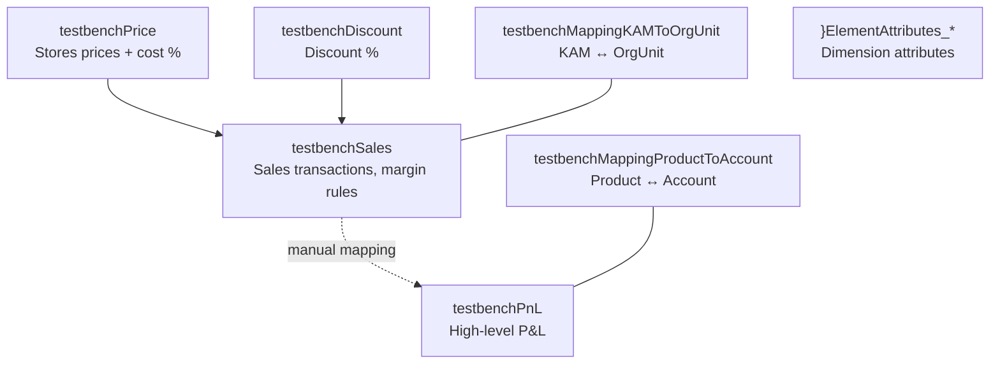

# Default Model Reference

This page documents the benchmark model defined in the `schema/` directory. The model simulates a basic sales business scenario with dimensions of varying sizes, cross-cube rule calculations, and several mapping cubes.

---

## Overview

---

## Dimensions

### testbenchAccount (`df_template`)

100 leaf elements (`Account00000001` …) under a single `All Account` root.

| Attribute | Type | Values |
|-----------|------|--------|
| `StatementType:s` | String | Random from `variables.account_type` (e.g. `PnL`, `BS`) |
| `Type:s` | String | Random from `variables.pnl_account_type` keys (e.g. `Revenue`, `CoS`) |
| `Sign:n` | Numeric | Derived from `Type` via `variables.pnl_account_type.sign` |

---

### testbenchCustomer (`df_template`)

100 000 leaf elements (`C00000001` …) under `All Customer`. Designed for sparsity benchmarking.

| Attribute | Type | Values |
|-----------|------|--------|
| `CountryOfOrigin:s` | String | Random country code from `variables.countries` keys |
| `Loyalty:s` | String | Random from `variables.loyalty` (e.g. `Bronze`, `Silver`, `Gold`) |

---

### testbenchKeyAccountManager (`df_template`)

100 leaf elements (`KAM01` …) under `All Key Account Manager`.

| Attribute | Type | Values |
|-----------|------|--------|
| `Seniority:s` | String | Random from `variables.seniority` |
| `Gender:s` | String | `M` or `F` |
| `CountryOfOrigin:s` | String | Random country code |
| `FirstName:s` | String | Random from `variables.gender.<Gender>.first_names` |
| `LastName:s` | String | Random from `variables.last_names` |

---

### testbenchMeasureDiscount (`elementlist`)

Flat. One element: `Discount Perc.` (Numeric).

---

### testbenchMeasureMappingKeyAccountManagerToOrganizationUnit (`elementlist`)

Flat. One element: `Assign Flag` (Numeric).

---

### testbenchMeasureMappingProductToAccount (`elementlist`)

Flat. One element: `Assign Flag` (Numeric).

---

### testbenchMeasurePnL (`elementlist`)

Flat. Elements: `InputValue`, `Calculated from Sales`, `ManualInput`, `Result` (all Numeric).

---

### testbenchMeasurePrice (`elementlist`)

Flat. Elements: `Price`, `Allocated Cost Perc.`, `Production Cost Perc.`, `Transportation and Packaging Perc.` (all Numeric).

---

### testbenchMeasureSales (`elementlist`)

Flat. Elements: `Quantity`, `Revenue`, `Discount`, `Cost of Sold Goods`, `Allocated Cost`, `Transportation and Packaging Cost`, `Margin`, `Price`, `Discount Perc.` (all Numeric).

---

### testbenchOrganizationUnit (`elementlist`)

Manual hierarchy: `Group` → `EMEA` / `Americas` / `APAC` → `Company01`–`Company21`.

| Attribute | Type | Values |
|-----------|------|--------|
| `NameLong:a` | Alias | Derived: `variables.countries.<code>.name + " Ltd."` |
| `Country:s` | String | Indexed from `variables.countries` keys |
| `Currency:s` | String | Derived: `variables.countries.<code>.currency` |

---

### testbenchPeriod (`custom`)

Generated by `dimension_period_builder.generate_time_dimension`. Default config: monthly periods 2024–2028.

Hierarchy: `All Periods` → `Year` → `Quarter` → `Month` (e.g. `M202401`).

| Attribute | Type | Description |
|-----------|------|-------------|
| `year:s`, `month:s`, `quarter:s` | String | Calculated date parts |
| `month_name:s`, `month_short_name:s` | String | Month name / abbreviation |
| `fiscal_year:s` | String | Fiscal year |
| `is_ytd:s` | String | `1` if period ≤ current month, else `0` |
| `PREV_PERIOD:s` | String | Element name of the preceding month |
| `NEXT_PERIOD:s` | String | Element name of the following month |
| `PREV_Y_PERIOD:s` | String | Same month, prior year |
| `NEXT_Y_PERIOD:s` | String | Same month, next year |

---

### testbenchProduct (`df_template`)

10 000 leaf elements (`P00000001` …). Hierarchy: `All Products` → `ProductGroupXX` → `ProductSubCategoryYY` → leaf.

| Attribute | Type | Values |
|-----------|------|--------|
| `AccountType:s` | String | Random element from `testbenchAccount` filtered to Revenue accounts (live MDX subset) |
| `Size:s` | String | Random from `variables.product_size` |

---

### testbenchVersion (`elementlist`)

Flat. Elements: `Actual`, `Forecast`, `Budget` (all Numeric).

| Attribute | Type | Values |
|-----------|------|--------|
| `ShortAlias:a` | Alias | Capital letters extracted from element name (e.g. `Actual → A`) |

---

## Cubes

### testbenchDiscount

Stores discount percentages by customer over time.

| # | Dimension |
|---|-----------|
| 1 | testbenchVersion |
| 2 | testbenchPeriod |
| 3 | testbenchCustomer |
| 4 | testbenchMeasureDiscount |

Data: `Discount Perc.` loaded with uniform random values in [0 %, 25 %].

---

### testbenchMappingKeyAccountManagerToOrganizationUnit

Holds assignment flags linking KAMs to Org Units.

| # | Dimension |
|---|-----------|
| 1 | testbenchVersion |
| 2 | testbenchPeriod |
| 3 | testbenchOrganizationUnit |
| 4 | testbenchKeyAccountManager |
| 5 | testbenchMeasureMappingKeyAccountManagerToOrganizationUnit |

No dataset template — populate manually or add one.

---

### testbenchMappingProductToAccount

Links Products + Sales Measures to P&L Accounts.

| # | Dimension |
|---|-----------|
| 1 | testbenchVersion |
| 2 | testbenchProduct |
| 3 | testbenchMeasureSales |
| 4 | testbenchAccount |
| 5 | testbenchMeasureMappingProductToAccount |

No dataset template — populate manually or add one.

---

### testbenchPnL

High-level P&L. No rules defined in default config — intended as a target for future mapping rules.

| # | Dimension |
|---|-----------|
| 1 | testbenchVersion |
| 2 | testbenchPeriod |
| 3 | testbenchOrganizationUnit |
| 4 | testbenchAccount |
| 5 | testbenchMeasurePnL |

---

### testbenchPrice

Stores product prices and cost percentages used by `testbenchSales` rules.

| # | Dimension |
|---|-----------|
| 1 | testbenchVersion |
| 2 | testbenchPeriod |
| 3 | testbenchProduct |
| 4 | testbenchMeasurePrice |

Data: all measures loaded with uniform random values within defined ranges.

---

### testbenchSales

Main transaction cube. Contains all business logic rules.

| # | Dimension |
|---|-----------|
| 1 | testbenchVersion |
| 2 | testbenchPeriod |
| 3 | testbenchProduct |
| 4 | testbenchCustomer |
| 5 | testbenchKeyAccountManager |
| 6 | testbenchMeasureSales |

**Rules summary:**

| Measure | Rule |
|---------|------|
| `Price` | `DB` lookup from `testbenchPrice`; average at consolidated levels |
| `Revenue` | `N: ['Quantity'] * ['Price']` |
| `Cost of Sold Goods` | `Revenue * DB(testbenchPrice, ..., 'Production Cost Perc.')` |
| `Allocated Cost` | `Revenue * DB(testbenchPrice, ..., 'Allocated Cost Perc.')` |
| `Transportation and Packaging Cost` | `Revenue * DB(testbenchPrice, ..., 'Transportation and Packaging Perc.')` |
| `Margin` | `Revenue - Costs` |
| `Discount Perc.` | `DB` lookup from `testbenchDiscount` by Customer; average at consolidated levels |
| `Discount` | `Revenue * ['Discount Perc.']` |

**Feeders:** `Quantity` feeds all calculated measures.

Data: `Quantity` loaded with normal-distribution random values (`mean=65`, `std_dev=20`, integers 0–100).
